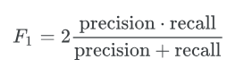
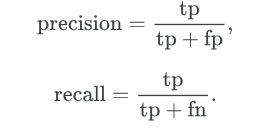

# Make Data Count - Finding Data References
### Identify scientific data use in papers and classify how they are mentioned.

link: <https://www.kaggle.com/competitions/make-data-count-finding-data-references>

# Overview

Your efforts can help [Make Data Count (MDC).](https://makedatacount.org/) Scientific data are critically undervalued even though they provide the basis for discoveries and innovations. We aim to improve our understanding of the links between scientific papers and the data used in those studies—what, when, and how they are mentioned. This will help to establish the value and impact of open scientific data for reuse. The current version of the MDC [Data Citation Corpus](https://zenodo.org/records/14897662) is an aggregation of links between data and papers, but these links are incomplete: they only cover a fraction of the literature and do not provide context on how the data were used. The outcome of this competition is a highly performant model that will continuously run on scientific literature to automate the addition of high quality and contextualized data-to-paper connections in to the MDC Data Citation Corpus.

# Description

### Goal of the Competition
You will identify all the data citations (references to research data) from the full text of scientific literature and tag the type of citation (primary or secondary):

- **Primary** - raw or processed data generated as part of the paper, specifically for the study
- **Secondary** - raw or processed data derived or reused from existing records or published data

### Context
[Make Data Count (MDC)](https://makedatacount.org/) is a global, community-driven initiative focused on establishing open standardized metrics for the evaluation and reward of research data reuse and impact. Through both advocacy and infrastructure projects, Make Data Count facilitates the recognition of data as a primary research output, promoting data sharing and reuse across data communities.

Highlighting and valuing data contributions will lead to a more collaborative, transparent, and efficient science, ultimately driving innovation and progress. To assure that this can happen, we need to connect and contextualize data, their relationship to papers, and their reuse.

### Why this is not YET a solved problem
Studies have shown that most research data remain “uncited” (~86 %) (Peters, I., Kraker, P., Lex, E. et al., 2016, https://doi.org/10.1007/s11192-016-1887-4) in the current data citation system which makes it very hard to identify and record them. In addition, references to data are harder to programmatically identify because of the many ways they are mentioned. For example, authors may provide a full description of the data in the methods section, they may indirectly mention it elsewhere, or provide a formal citation in the reference list. Additionally, authors may use variable language when describing the type of relationship between the data and paper, such as suggesting data their data are openly available (“publicly available”) or mentioning the data were obtained from elsewhere (for instance, “obtained from”).

### Potential Impact
The winning Kaggle model will enable MDC to update, release, and maintain an open, comprehensive and high quality set of references to data in scientific papers. The subsequent corpus will be made freely available for use by research communities, allowing for the development of better tools, a better understanding of how data are reused, improved ways of capturing broader researcher outputs, and a shift towards valuing data.


----------------------------------------------------------------


## Evaluation
In this competition, the metric is F1-Score. The F1-score, commonly used in information retrieval, measures accuracy using the statistics precision (p) and recall (r). Precision is the ratio of true positives (tp) to all predicted positives (tp + fp). Recall is the ratio of true positives to all actual positives (tp + fn). The F1 score is given by:


where


The F1 metric weights recall and precision equally, and a good retrieval algorithm will maximize both precision and recall simultaneously. Thus, moderately good performance on both will be favored over extremely good performance on one and poor performance on the other.


### Submission File

You must identify data references contained in the test dataset. These predictions form unique tuples of (article_id, dataset_id, type). If an article contains multiple references of the same dataset_id and type, it should only be predicted once. Only articles containing data references be included in submissions. Articles with no data references should not be included in the submission, and will be penalized as false positives if they are. When mining the research paper full text, the DOIs may appear with or without the 'https://doi.org' stem. Convert all DOIs into the full DOI format in the submission (https://doi.org/[prefix]/[suffix]). The file should contain a header and use the following format:

```
row_id,article_id,dataset_id,type
0,10.1002_cssc.202201821,https://doi.org/10.5281/zenodo.7074790,Primary
1,10.1002_esp.5090,CHEMBL1097,Secondary
...
```
--------------------------------------------------------

### Timeline

- June 11, 2025 - Start Date.
- September 2, 2025 - Entry Deadline. You must accept the competition rules before this date in order to compete.
- September 2, 2025 - Team Merger Deadline. This is the last day participants may join or merge teams.
- September 9, 2025 - Final Submission Deadline.

All deadlines are at 11:59 PM UTC on the corresponding day unless otherwise noted. The competition organizers reserve the right to update the contest timeline if they deem it necessary.


------------------------------------------------------------

## Prizes
### Leaderboard Prizes

- 1st place - $40,000
- 2nd place - $20,000
- 3rd place - $17,000
- 4th place - $13,000
- 5th Place - $10,000

Competition prizes are kindly sponsored by The Navigation Fund and Chan Zuckerberg Initiative.

---------------------------------------------------------------

# Make Data Count
Make Data Count is a global, community-led initiative focused on the development of open data assessment metrics. Driven by partners at academic institutions and non-profit research infrastructure providers, MDC has worked for over a decade to develop technical infrastructure and standardized approaches for assessing data usage, produce evidence-based studies on researcher behavior in citing and using data, and to drive a community of practice around responsible and meaningful evaluation of data reuse. MDC has long been supported by philanthropic organizations, in-kind support from partner institutions, and contributions from community partners.

The competition is sponsored by MDC's fiscal home, DataCite International Data Citation Initiative e.V, with prize funds from The Navigation Fund and Chan Zuckerberg Initiative


-----------------------------------------------------------------

# Code Requirements


### This is a Code Competition

Submissions to this competition must be made through Notebooks. In order for the "Submit" button to be active after a commit, the following conditions must be met:

- CPU Notebook <= 9 hours run-time
- GPU Notebook <= 9 hours run-time
- Internet access disabled
- Freely & publicly available external data is allowed, including pre-trained models
- Submission file must be named submission.csv


Please see the [Code Competition FAQ](https://www.kaggle.com/docs/competitions#notebooks-only-FAQ) for more information on how to submit. And review the [code debugging doc](https://www.kaggle.com/code-competition-debugging) if you are encountering submission errors.

----------------------------------------------------------------


# Citation

Make Data Count, Maggie Demkin, and Walter Reade. Make Data Count - Finding Data References. https://kaggle.com/competitions/make-data-count-finding-data-references, 2025. Kaggle.